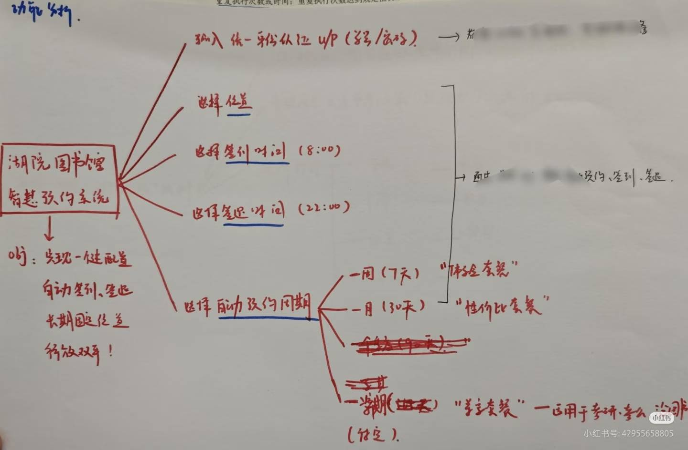

# SmartLibrary（SmartLib）

> **“此去经年，愿我们都能在各自的热爱里，顶峰相见！”**

SmartLib 是一个智能图书馆预约签到系统。它不仅是一个工具，更是一个从考研备考的琐碎烦恼中诞生、历经多次迭代重构、最终走向平稳运行的开发故事。系统目前支持自动预约、自动签到、邮件通知等核心功能，旨在为用户提供最便捷的座位管理体验。

## 01 我和TA的故事

①：是否和我一样的痛苦呢？

曾经，作为湖州学院的一名清澈愚蠢的学生

在考研期间，经常遇到忘记预约、约不到想要的位置

或者一到22:30学校官方预约系统甚至都进不去（请问我怎么约啊\~）

又或者因为备考期间渴望“固定座位的归属感”

总之，不怎么喜欢官方预约系统（你们觉得呢😜？）

②：于是我开始想有没有办法\~

仍记得在2025年的一个下午（本在痛苦刷英语阅读的我）

思维忽然开始散发，便在草稿纸上写下了：

**“不如，我自己做个湖院图书馆智慧预约系统吧！”**

*（你看吧，当时只是纸上的想法欸，如今变成了现实）*

③：想想也不够呀，得去做了!

那天之后，我便抽空写代码（掉头发\~）、测试、修bug（掉头发\~）、优化...

: : ) 对了，目前秀发还永驻！

不到一周左右，v1版本就诞生了

回想起预约成功的第一天，看到屏幕上的 `[INFO] ✔ 用户 余** 预约 2025-10-21 预约成功`

在宿舍的我和室友大喊：**我真的成功了！WC！NICE！🐂不🐂🍺！**

不敢相信起初在纸上的想法变成了现实，那种心情至今难忘

随后变继续优化迭代，直至现在平稳运行的v2版本，以及正在开发的v3版本

④：我应该挺厉害的吧？！

此刻，写下这段文字时已是凌晨2026年5月19日的3:29，回望这一路

SmartLib 给我的是：

- 从0到1、从1到60、再从60到100（AI时代到100远不够，要到1k、1w）
- 从想法到产品、从迭代到完善、从部署到上线
- 从技术栈选型到重构、从开发到测试、从后端到前端
- 从0用户到10+、100+用户，希望越来越多！

带来的成就感、技术成长、全栈开发能力、项目管理能力、运营推广能力...

都是任何其他项目都无法比拟的！

⑤：未来的路还长着，我会一直走下去！

这一路走来，我和它的故事还在继续

无论未来个人开发也好、创业也好

这段经历都一定会是我最坚硬的底气

最后，感谢所有在我人生天色未亮时，出现的提灯人

**此去经年，愿我们都能在各自的热爱里，顶峰相见！**

## 02 历史版本迭代

> *这一路走来，经历了多个版本的迭代，每个版本都带来了新的功能和改进，熬的每一个夜、掉的每一根头发都是为了为用户提供更好的服务！*

### smartlib\_v3\_焕新版本（smartlib3.0分支）

- [ ] 正在努力消耗头发开发中，敬请期待，预计7月上线喔\~
- [ ] 基础功能：在线选位、自动预约、自动签到、邮件通知
- [ ] 焕新功能：用户端（web）、订阅付费、推广返佣...

### smartlib\_v2\_优化版本 （[smartlib2.0分支](https://github.com/Whale-Yu/SmartLib/tree/smartlib_v2)）

- [x] 🎉 2026-05-17 v2.4.0 【pref】优化邮件服务，实现 3 个邮件服务商的自动重试与故障切换机制
- [x] 🎉 2026-05-11 v2.4.0 【feat】新增Google邮箱服务商
- [x] 🎉 2026-05-10 v2.3.0 【feat】新增QQ邮箱2双账号备用机制，避免单邮箱因频率风控导致发送失败
- [x] 🎉 2026-05-09 v2.2.1 【pref】优化邮件的排版内容、样式
- [x] 🎉 2026-03-11 v2.2.0 【feat】新增邮件通知服务（接入QQ-SMTP服务）
- [x] 🎉 2026-03-09 v2.1.0 【feat】新增合并预约和签到脚本，大幅度节省服务器资源
- [x] 🎉 2026-03-07 **v2.0.0** 【refactor】颠覆性技术栈重构，smartlib2.0-v2.0.0正式上线！
  - 1.攻克登录接口的逆向工程，完成cookies的获取和使用
  - 2.采用纯请求的方式，摈弃chromedriver+selenium的方案
  - 3.本次重构解决了chromedriver的资源消耗、环境配置、项目部署、路径问题等难点问题
- [x] 🎉 2026-03-02 **v2.0.0** 【feat】smartlib项目开始计划重构（基于[smartlib1.0](https://github.com/Whale-Yu/SmartLib/tree/smartlib_v1)分支）

### smartlib\_v1\_雏形版本（[smartlib1.0分支](https://github.com/Whale-Yu/SmartLib/tree/smartlib_v1)）

- [x] 🚀 不再维护该分支，v2版本已切换到[smartlib2.0分支](https://github.com/Whale-Yu/SmartLib/tree/smartlib_v2)。
- [x] 🎉 2026-03-05 v1.0.2 【fix】修复win报的chromedriver路径错误
- [x] 🎉 2026-03-04 v1.0.1 【pref】优化chromedriver相关核心内容
  - 1.修正 get\_chromedriver\_path() 函数，通过正则表达式从 webdriver\_manager 返回路径中提取正确的 chromedriver 可执行文件路径
  - 2.添加 \_chrome\_init\_lock 线程锁保护 create\_driver() 函数，避免多线程并发创建 Chrome 实例冲突
  - 3.新增 Linux 系统适配：根据操作系统自动匹配 chromedriver-win32（Windows）或 chromedriver-linux64（Linux）目录
- [x] 🎉 2026-03-02 **v1.0.0** 【feat】smartlib项目重启，并部署新服务器投入使用！
- [x] 🚀 2026-1至2月服务器到期，停止维护
- [x] 🚀 2025-10至12月更新未记录
- [x] 🎉 2025-10-15 **v1.0.0** v1.0.0开发完成，并进行内部测试、使用！

